# IntelliJ IDEA 常用配置

本配置为 `flagwind` 团队日常使用的配置，您也可以直接下载 [settings.jar]("./settings/flagwind.jar") 文件直接导入 IntelliJ IDEA。

## VM 参数修改

    Help > Edit Custom VM Options

通过调整 VM 参数来提升 IntelliJ IDEA 的运行速度。

- `-Xms128m` Xms是用来设置程序初始化时的内存大小，增加这个值的话程序的启动性能会得到提高，建议8G内存以上机器设置为：`-Xms512m`
- `-Xmx750m` Xmx是用来设置程序能够使用的最大内存数，建议8G内存以上机器设置为：`-Xmx1024m`
- `-XX:ReservedCodeCacheSize=240m` 缓存大小，建议8G内存以上机器设置为： `-XX:ReservedCodeCacheSize=512m`

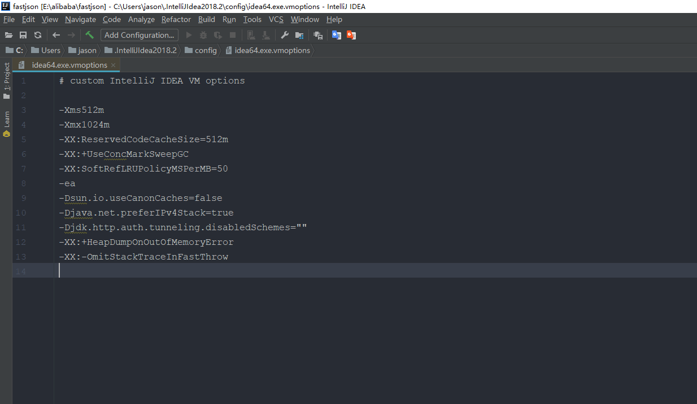

## IntelliJ IDEA 字体修改

    File > Settings > Appearance & Behavior > Appearance

建议将主题设置为`Darcula`，字体设置为`Microsoft YaHei UI`，字号设置为`13`。

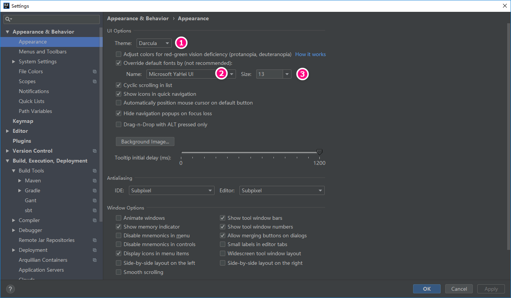

## 修改编辑区主题

    File > Settings > Editor > Color Scheme

编辑区主题，也就是代码书写区的主题。

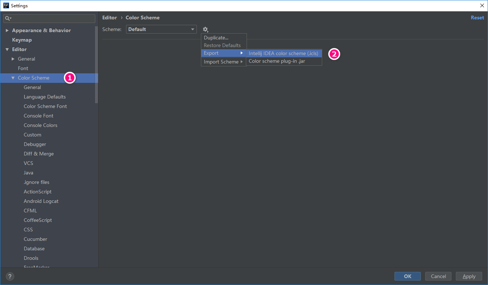

- 标注1所示，可以在各个子菜单进行自定义颜色修改。
- 标注2所示，可以导入第三方模板，这里推荐几个模板的下载地址。
> [https://github.com/flagwind/intellij-idea-color-scheme](https://github.com/flagwind/intellij-idea-color-scheme)  
> [http://color-themes.com](http://color-themes.com/?view=index)  
> [http://www.phpstorm-themes.com](http://www.phpstorm-themes.com/)

## 文件编码设置

    File > Settings > Editor > File Encodings

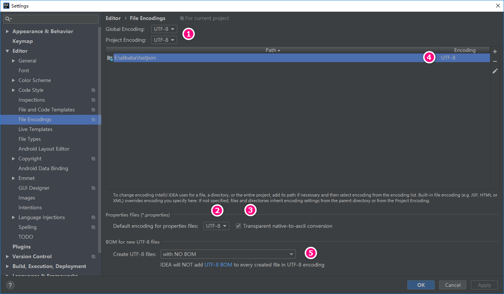

- 标注1所示，建议将`IDE Encoding`和`Project Encoding`设置为`UTF-8`。
- 标注2所示，IntelliJ IDEA 可以对`Properties`文件进行专门的编码设置，一般也建议改为`UTF-8`。
- 标注3所示，对于`Properties`文件，属性`Transparent native-to-ascii conversion`主要用于转换ASCII码，一般都要勾选，不然`Properties`文件中的注释显示的都不会是中文。
- 标注4所示，IntelliJ IDEA 除了支持对整个Project设置编码之外，还支持对目录、文件进行编码设置。如果你要对目录进行编码设置的话，可能会出现需要转换编码的弹出操作选择，强烈建议在转换之前做好文件备份，不然可能出现转换过程变成乱码，无法还原。
- 标注5所示，建议设置为UTF-8无BOM格式，即：`width NO BOM`。

## 快捷键设置

    File > Settings > Keymap

IntelliJ IDEA 的设计思维是提倡键盘优先于鼠标的，所以各种快捷键组合层出不穷，对于快捷键设置也有各种支持，对于其他 IDE 的快捷键组合也有预设模板进行支持。

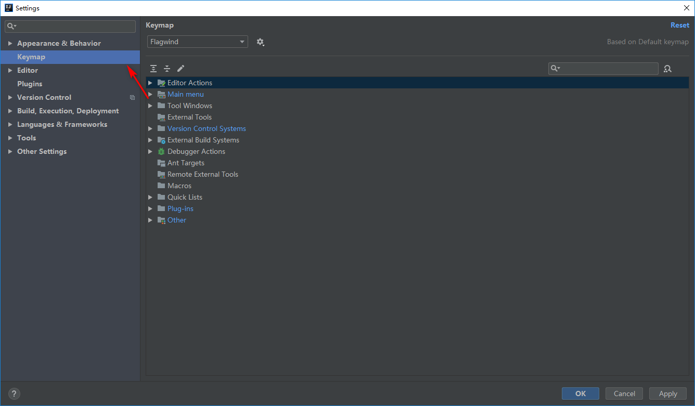

**默认快捷键：**

### Ctrl

|快捷键|介绍|
|:---------|:---------|
|<kbd>Ctrl</kbd> + <kbd>F</kbd>|在当前文件进行文本查找 `（必备）` |
|<kbd>Ctrl</kbd> + <kbd>R</kdb>|在当前文件进行文本替换 `（必备）` |
|<kbd>Ctrl</kbd> + <kbd>Z</kdb>|撤销 `（必备）` |
|<kbd>Ctrl</kbd> + <kbd>Y</kdb>|删除光标所在行 或 删除选中的行 `（必备）` |
|<kbd>Ctrl</kbd> + <kbd>X</kdb>|剪切光标所在行 或 剪切选择内容|
|<kbd>Ctrl</kbd> + <kbd>C</kdb>|复制光标所在行 或 复制选择内容|
|<kbd>Ctrl</kbd> + <kbd>D</kdb>|复制光标所在行 或 复制选择内容，并把复制内容插入光标位置下面 `（必备）` |
|<kbd>Ctrl</kbd> + <kbd>W</kdb>|递进式选择代码块。可选中光标所在的单词或段落，连续按会在原有选中的基础上再扩展选中范围 `（必备）` |
|<kbd>Ctrl</kbd> + <kbd>E</kdb>|显示最近打开的文件记录列表 `（必备）` |
|<kbd>Ctrl</kbd> + <kbd>N</kdb>|根据输入的 **类名** 查找类文件 `（必备）` |
|<kbd>Ctrl</kbd> + <kbd>G</kdb>|在当前文件跳转到指定行处|
|<kbd>Ctrl</kbd> + <kbd>J</kdb>|插入自定义动态代码模板 `（必备）` |
|<kbd>Ctrl</kbd> + <kbd>P</kdb>|方法参数提示显示 `（必备）` |
|<kbd>Ctrl</kbd> + <kbd>Q</kdb>|光标所在的变量 / 类名 / 方法名等上面（也可以在提示补充的时候按），显示文档内容|
|<kbd>Ctrl</kbd> + <kbd>U</kdb>|前往当前光标所在的方法的父类的方法 / 接口定义 `（必备）` |
|<kbd>Ctrl</kbd> + <kbd>B</kdb>|进入光标所在的方法/变量的接口或是定义处，等效于 `Ctrl + 左键单击`  `（必备）` |
|<kbd>Ctrl</kbd> + <kbd>K</kdb>|版本控制提交项目，需要此项目有加入到版本控制才可用|
|<kbd>Ctrl</kbd> + <kbd>T</kdb>|版本控制更新项目，需要此项目有加入到版本控制才可用|
|<kbd>Ctrl</kbd> + <kbd>H</kdb>|显示当前类的层次结构|
|<kbd>Ctrl</kbd> + <kbd>O</kdb>|选择可重写的方法|
|<kbd>Ctrl</kbd> + <kbd>I</kdb>|选择可继承的方法|
|<kbd>Ctrl</kbd> + <kbd>\+</kdb>|展开代码|
|<kbd>Ctrl</kbd> + <kbd>\-</kdb>|折叠代码|
|<kbd>Ctrl</kbd> + <kbd>/</kdb>|注释光标所在行代码，会根据当前不同文件类型使用不同的注释符号 `（必备）` |
|<kbd>Ctrl</kbd> + <kbd>\[</kdb>|移动光标到当前所在代码的花括号开始位置|
|<kbd>Ctrl</kbd> + <kbd>\]</kdb>|移动光标到当前所在代码的花括号结束位置|
|<kbd>Ctrl</kbd> + <kbd>F1</kdb>|在光标所在的错误代码处显示错误信息 `（必备）` |
|<kbd>Ctrl</kbd> + <kbd>F3</kdb>|调转到所选中的词的下一个引用位置 `（必备）` |
|<kbd>Ctrl</kbd> + <kbd>F4</kdb>|关闭当前编辑文件|
|<kbd>Ctrl</kbd> + <kbd>F8</kdb>|在 Debug 模式下，设置光标当前行为断点，如果当前已经是断点则去掉断点|
|<kbd>Ctrl</kbd> + <kbd>F9</kdb>|执行 Make Project 操作|
|<kbd>Ctrl</kbd> + <kbd>F11</kdb>|选中文件 / 文件夹，使用助记符设定 / 取消书签 `（必备）` |
|<kbd>Ctrl</kbd> + <kbd>F12</kdb>|弹出当前文件结构层，可以在弹出的层上直接输入，进行筛选|
|<kbd>Ctrl</kbd> + <kbd>Tab</kdb>|编辑窗口切换，如果在切换的过程又加按上delete，则是关闭对应选中的窗口|
|<kbd>Ctrl</kbd> + <kbd>End</kdb>|跳到文件尾|
|<kbd>Ctrl</kbd> + <kbd>Home</kdb>|跳到文件头|
|<kbd>Ctrl</kbd> + <kbd>Space</kdb>|基础代码补全，默认在 Windows 系统上被输入法占用，需要进行修改，建议修改为 `Ctrl + 逗号` `（必备）` |
|<kbd>Ctrl</kbd> + <kbd>Delete</kdb>|删除光标后面的单词或是中文句 `（必备）` |
|<kbd>Ctrl</kbd> + <kbd>BackSpace</kdb>|删除光标前面的单词或是中文句 `（必备）` |
|<kbd>Ctrl</kbd> + <kbd>1,2,3...9</kdb>|定位到对应数值的书签位置 `（必备）` |
|<kbd>Ctrl</kbd> + <kbd>左键单击</kdb>|在打开的文件标题上，弹出该文件路径 `（必备）` |
|<kbd>Ctrl</kbd> + <kbd>光标定位</kdb>|按 Ctrl 不要松开，会显示光标所在的类信息摘要|
|<kbd>Ctrl</kbd> + <kbd>左方向键</kdb>|光标跳转到当前单词 / 中文句的左侧开头位置 `（必备）` |
|<kbd>Ctrl</kbd> + <kbd>右方向键</kdb>|光标跳转到当前单词 / 中文句的右侧开头位置 `（必备）` |
|<kbd>Ctrl</kbd> + <kbd>前方向键</kdb>|等效于鼠标滚轮向前效果 `（必备）` |
|<kbd>Ctrl</kbd> + <kbd>后方向键</kdb>|等效于鼠标滚轮向后效果 `（必备）` |

### Alt

|快捷键|介绍|
|:---------|:---------|
|<kbd>Alt</kbd> + <kbd>\`</kbd>|显示版本控制常用操作菜单弹出层 `（必备）` |
|<kbd>Alt</kbd> + <kbd>Q</kbd>|弹出一个提示，显示当前类的声明 / 上下文信息|
|<kbd>Alt</kbd> + <kbd>F1</kbd>|显示当前文件选择目标弹出层，弹出层中有很多目标可以进行选择 `（必备）` |
|<kbd>Alt</kbd> + <kbd>F2</kbd>|对于前面页面，显示各类浏览器打开目标选择弹出层|
|<kbd>Alt</kbd> + <kbd>F3</kbd>|选中文本，逐个往下查找相同文本，并高亮显示|
|<kbd>Alt</kbd> + <kbd>F7</kbd>|查找光标所在的方法 / 变量 / 类被调用的地方|
|<kbd>Alt</kbd> + <kbd>F8</kbd>|在 Debug 的状态下，选中对象，弹出可输入计算表达式调试框，查看该输入内容的调试结果|
|<kbd>Alt</kbd> + <kbd>Home</kbd>|定位 / 显示到当前文件的 `Navigation Bar` |
|<kbd>Alt</kbd> + <kbd>Enter</kbd>|IntelliJ IDEA 根据光标所在问题，提供快速修复选择，光标放在的位置不同提示的结果也不同 `（必备）` |
|<kbd>Alt</kbd> + <kbd>Insert</kbd>|代码自动生成，如生成对象的 set / get 方法，构造函数，toString() 等 `（必备）` |
|<kbd>Alt</kbd> + <kbd>左方向键</kbd>|切换当前已打开的窗口中的子视图，比如Debug窗口中有Output、Debugger等子视图，用此快捷键就可以在子视图中切换 `（必备）` |
|<kbd>Alt</kbd> + <kbd>右方向键</kbd>|按切换当前已打开的窗口中的子视图，比如Debug窗口中有Output、Debugger等子视图，用此快捷键就可以在子视图中切换 `（必备）` |
|<kbd>Alt</kbd> + <kbd>前方向键</kbd>|当前光标跳转到当前文件的前一个方法名位置 `（必备）` |
|<kbd>Alt</kbd> + <kbd>后方向键</kbd>|当前光标跳转到当前文件的后一个方法名位置 `（必备）` |
|<kbd>Alt</kbd> + <kbd>1,2,3...9</kbd>|显示对应数值的选项卡，其中 1 是 Project 用得最多 `（必备）` |

### Shift

|快捷键|介绍|
|:---------|:---------|
|<kbd>Shift</kbd> + <kbd>F1</kbd>|如果有外部文档可以连接外部文档|
|<kbd>Shift</kbd> + <kbd>F2</kbd>|跳转到上一个高亮错误 或 警告位置|
|<kbd>Shift</kbd> + <kbd>F3</kbd>|在查找模式下，查找匹配上一个|
|<kbd>Shift</kbd> + <kbd>F4</kbd>|对当前打开的文件，使用新Windows窗口打开，旧窗口保留|
|<kbd>Shift</kbd> + <kbd>F6</kbd>|对文件 / 文件夹 重命名|
|<kbd>Shift</kbd> + <kbd>F7</kbd>|在 Debug 模式下，智能步入。断点所在行上有多个方法调用，会弹出进入哪个方法|
|<kbd>Shift</kbd> + <kbd>F8</kbd>|在 Debug 模式下，跳出，表现出来的效果跟 `F9` 一样|
|<kbd>Shift</kbd> + <kbd>F9</kbd>|等效于点击工具栏的 `Debug` 按钮|
|<kbd>Shift</kbd> + <kbd>F10</kbd>|等效于点击工具栏的 `Run` 按钮|
|<kbd>Shift</kbd> + <kbd>F11</kbd>|弹出书签显示层 `（必备）` |
|<kbd>Shift</kbd> + <kbd>Tab</kbd>|取消缩进 `（必备）` |
|<kbd>Shift</kbd> + <kbd>ESC</kbd>|隐藏当前 或 最后一个激活的工具窗口|
|<kbd>Shift</kbd> + <kbd>End</kbd>|选中光标到当前行尾位置|
|<kbd>Shift</kbd> + <kbd>Home</kbd>|选中光标到当前行头位置|
|<kbd>Shift</kbd> + <kbd>Enter</kbd>|开始新一行。光标所在行下空出一行，光标定位到新行位置 `（必备）` |
|<kbd>Shift</kbd> + <kbd>左键单击</kbd>|在打开的文件名上按此快捷键，可以关闭当前打开文件 `（必备）` |
|<kbd>Shift</kbd> + <kbd>滚轮前后滚动</kbd>|当前文件的横向滚动轴滚动 `（必备）` |

### Ctrl + Alt

|快捷键|介绍|
|:---------|:---------|
|<kbd>Ctrl</kbd> + <kbd>Alt</kbd> + <kbd>L</kbd>|格式化代码，可以对当前文件和整个包目录使用 `（必备）` |
|<kbd>Ctrl</kbd> + <kbd>Alt</kbd> + <kbd>O</kbd>|优化导入的类，可以对当前文件和整个包目录使用 `（必备）` |
|<kbd>Ctrl</kbd> + <kbd>Alt</kbd> + <kbd>I</kbd>|光标所在行 或 选中部分进行自动代码缩进，有点类似格式化|
|<kbd>Ctrl</kbd> + <kbd>Alt</kbd> + <kbd>T</kbd>|对选中的代码弹出环绕选项弹出层 `（必备）` |
|<kbd>Ctrl</kbd> + <kbd>Alt</kbd> + <kbd>J</kbd>|弹出模板选择窗口，将选定的代码加入动态模板中|
|<kbd>Ctrl</kbd> + <kbd>Alt</kbd> + <kbd>H</kbd>|调用层次|
|<kbd>Ctrl</kbd> + <kbd>Alt</kbd> + <kbd>B</kbd>|在某个调用的方法名上使用会跳到具体的实现处，可以跳过接口|
|<kbd>Ctrl</kbd> + <kbd>Alt</kbd> + <kbd>C</kbd>|重构-快速提取常量|
|<kbd>Ctrl</kbd> + <kbd>Alt</kbd> + <kbd>F</kbd>|重构-快速提取成员变量|
|<kbd>Ctrl</kbd> + <kbd>Alt</kbd> + <kbd>V</kbd>|重构-快速提取变量|
|<kbd>Ctrl</kbd> + <kbd>Alt</kbd> + <kbd>Y</kbd>|同步、刷新|
|<kbd>Ctrl</kbd> + <kbd>Alt</kbd> + <kbd>S</kbd>|打开 IntelliJ IDEA 系统设置 `（必备）` |
|<kbd>Ctrl</kbd> + <kbd>Alt</kbd> + <kbd>F7</kbd>|显示使用的地方。寻找被该类或是变量被调用的地方，用弹出框的方式找出来|
|<kbd>Ctrl</kbd> + <kbd>Alt</kbd> + <kbd>F11</kbd>|切换全屏模式|
|<kbd>Ctrl</kbd> + <kbd>Alt</kbd> + <kbd>Enter</kbd>|光标所在行上空出一行，光标定位到新行 `（必备）` |
|<kbd>Ctrl</kbd> + <kbd>Alt</kbd> + <kbd>Home</kbd>|弹出跟当前文件有关联的文件弹出层|
|<kbd>Ctrl</kbd> + <kbd>Alt</kbd> + <kbd>Space</kbd>|类名自动完成|
|<kbd>Ctrl</kbd> + <kbd>Alt</kbd> + <kbd>左方向键</kbd>|退回到上一个操作的地方 `（必备）` |
|<kbd>Ctrl</kbd> + <kbd>Alt</kbd> + <kbd>右方向键</kbd>|前进到上一个操作的地方 `（必备）` |
|<kbd>Ctrl</kbd> + <kbd>Alt</kbd> + <kbd>前方向键</kbd>|在查找模式下，跳到上个查找的文件|
|<kbd>Ctrl</kbd> + <kbd>Alt</kbd> + <kbd>后方向键</kbd>|在查找模式下，跳到下个查找的文件|
|<kbd>Ctrl</kbd> + <kbd>Alt</kbd> + <kbd>右括号（]）</kbd>|在打开多个项目的情况下，切换下一个项目窗口|
|<kbd>Ctrl</kbd> + <kbd>Alt</kbd> + <kbd>左括号（[）</kbd>|在打开多个项目的情况下，切换上一个项目窗口|

### Ctrl + Shift

|快捷键|介绍|
|:---------|:---------|
|<kbd>Ctrl</kbd> + <kbd>Shift</kbd> + <kbd>F</kbd>|根据输入内容查找整个项目 或 指定目录内文件 `（必备）` |
|<kbd>Ctrl</kbd> + <kbd>Shift</kbd> + <kbd>R</kbd>|根据输入内容替换对应内容，范围为整个项目 或 指定目录内文件 `（必备）` |
|<kbd>Ctrl</kbd> + <kbd>Shift</kbd> + <kbd>J</kbd>|自动将下一行合并到当前行末尾 `（必备）` |
|<kbd>Ctrl</kbd> + <kbd>Shift</kbd> + <kbd>Z</kbd>|取消撤销 `（必备）` |
|<kbd>Ctrl</kbd> + <kbd>Shift</kbd> + <kbd>W</kbd>|递进式取消选择代码块。可选中光标所在的单词或段落，连续按会在原有选中的基础上再扩展取消选中范围 `（必备）` |
|<kbd>Ctrl</kbd> + <kbd>Shift</kbd> + <kbd>N</kbd>|通过文件名定位 / 打开文件 / 目录，打开目录需要在输入的内容后面多加一个正斜杠 `（必备）` |
|<kbd>Ctrl</kbd> + <kbd>Shift</kbd> + <kbd>U</kbd>|对选中的代码进行大 / 小写轮流转换 `（必备）` |
|<kbd>Ctrl</kbd> + <kbd>Shift</kbd> + <kbd>T</kbd>|对当前类生成单元测试类，如果已经存在的单元测试类则可以进行选择 `（必备）` |
|<kbd>Ctrl</kbd> + <kbd>Shift</kbd> + <kbd>C</kbd>|复制当前文件磁盘路径到剪贴板 `（必备）` |
|<kbd>Ctrl</kbd> + <kbd>Shift</kbd> + <kbd>V</kbd>|弹出缓存的最近拷贝的内容管理器弹出层|
|<kbd>Ctrl</kbd> + <kbd>Shift</kbd> + <kbd>E</kbd>|显示最近修改的文件列表的弹出层|
|<kbd>Ctrl</kbd> + <kbd>Shift</kbd> + <kbd>H</kbd>|显示方法层次结构|
|<kbd>Ctrl</kbd> + <kbd>Shift</kbd> + <kbd>B</kbd>|跳转到类型声明处 `（必备）` |
|<kbd>Ctrl</kbd> + <kbd>Shift</kbd> + <kbd>I</kbd>|快速查看光标所在的方法 或 类的定义|
|<kbd>Ctrl</kbd> + <kbd>Shift</kbd> + <kbd>A</kbd>|查找动作 / 设置|
|<kbd>Ctrl</kbd> + <kbd>Shift</kbd> + <kbd>/</kbd>|代码块注释 `（必备）` |
|<kbd>Ctrl</kbd> + <kbd>Shift</kbd> + <kbd>\[</kbd>|选中从光标所在位置到它的顶部中括号位置 `（必备）` |
|<kbd>Ctrl</kbd> + <kbd>Shift</kbd> + <kbd>\]</kbd>|选中从光标所在位置到它的底部中括号位置 `（必备）` |
|<kbd>Ctrl</kbd> + <kbd>Shift</kbd> + <kbd>\+</kbd>|展开所有代码 `（必备）` |
|<kbd>Ctrl</kbd> + <kbd>Shift</kbd> + <kbd>\-</kbd>|折叠所有代码 `（必备）` |
|<kbd>Ctrl</kbd> + <kbd>Shift</kbd> + <kbd>F7</kbd>|高亮显示所有该选中文本，按Esc高亮消失 `（必备）` |
|<kbd>Ctrl</kbd> + <kbd>Shift</kbd> + <kbd>F8</kbd>|在 Debug 模式下，指定断点进入条件|
|<kbd>Ctrl</kbd> + <kbd>Shift</kbd> + <kbd>F9</kbd>|编译选中的文件 / 包 / Module|
|<kbd>Ctrl</kbd> + <kbd>Shift</kbd> + <kbd>F12</kbd>|编辑器最大化 `（必备）` |
|<kbd>Ctrl</kbd> + <kbd>Shift</kbd> + <kbd>Space</kbd>|智能代码提示|
|<kbd>Ctrl</kbd> + <kbd>Shift</kbd> + <kbd>Enter</kbd>|自动结束代码，行末自动添加分号 `（必备）` |
|<kbd>Ctrl</kbd> + <kbd>Shift</kbd> + <kbd>Backspace</kbd>|退回到上次修改的地方 `（必备）` |
|<kbd>Ctrl</kbd> + <kbd>Shift</kbd> + <kbd>1,2,3...9</kbd>|快速添加指定数值的书签 `（必备）` |
|<kbd>Ctrl</kbd> + <kbd>Shift</kbd> + <kbd>左键单击</kbd>|把光标放在某个类变量上，按此快捷键可以直接定位到该类中 `（必备）` |
|<kbd>Ctrl</kbd> + <kbd>Shift</kbd> + <kbd>左方向键</kbd>|在代码文件上，光标跳转到当前单词 / 中文句的左侧开头位置，同时选中该单词 / 中文句 `（必备）` |
|<kbd>Ctrl</kbd> + <kbd>Shift</kbd> + <kbd>右方向键</kbd>|在代码文件上，光标跳转到当前单词 / 中文句的右侧开头位置，同时选中该单词 / 中文句 `（必备）` |
|<kbd>Ctrl</kbd> + <kbd>Shift</kbd> + <kbd>前方向键</kbd>|光标放在方法名上，将方法移动到上一个方法前面，调整方法排序 `（必备）` |
|<kbd>Ctrl</kbd> + <kbd>Shift</kbd> + <kbd>后方向键</kbd>|光标放在方法名上，将方法移动到下一个方法前面，调整方法排序 `（必备）` |

### Alt + Shift

|快捷键|介绍|
|:---------|:---------|
|<kbd>Alt</kbd> + <kbd>Shift</kbd> + <kbd>N</kbd>|选择 / 添加 task `（必备）` |
|<kbd>Alt</kbd> + <kbd>Shift</kbd> + <kbd>F</kbd>|显示添加到收藏夹弹出层 / 添加到收藏夹|
|<kbd>Alt</kbd> + <kbd>Shift</kbd> + <kbd>C</kbd>|查看最近操作项目的变化情况列表|
|<kbd>Alt</kbd> + <kbd>Shift</kbd> + <kbd>I</kbd>|查看项目当前文件|
|<kbd>Alt</kbd> + <kbd>Shift</kbd> + <kbd>F7</kbd>|在 Debug 模式下，下一步，进入当前方法体内，如果方法体还有方法，则会进入该内嵌的方法中，依此循环进入|
|<kbd>Alt</kbd> + <kbd>Shift</kbd> + <kbd>F9</kbd>|弹出 `Debug`  的可选择菜单|
|<kbd>Alt</kbd> + <kbd>Shift</kbd> + <kbd>F10</kbd>|弹出 `Run`  的可选择菜单|
|<kbd>Alt</kbd> + <kbd>Shift</kbd> + <kbd>左键双击</kbd>|选择被双击的单词 / 中文句，按住不放，可以同时选择其他单词 / 中文句 `（必备）` |
|<kbd>Alt</kbd> + <kbd>Shift</kbd> + <kbd>前方向键</kbd>|移动光标所在行向上移动 `（必备）` |
|<kbd>Alt</kbd> + <kbd>Shift</kbd> + <kbd>后方向键</kbd>|移动光标所在行向下移动 `（必备）` |

### Ctrl + Shift + Alt

|快捷键|介绍|
|:---------|:---------|
|<kbd>Ctrl</kbd> + <kbd>Shift</kbd> + <kbd>Alt</kbd> + <kbd>V</kbd>|无格式黏贴 `（必备）` |
|<kbd>Ctrl</kbd> + <kbd>Shift</kbd> + <kbd>Alt</kbd> + <kbd>N</kbd>|前往指定的变量 / 方法|
|<kbd>Ctrl</kbd> + <kbd>Shift</kbd> + <kbd>Alt</kbd> + <kbd>S</kbd>|打开当前项目设置 `（必备）` |
|<kbd>Ctrl</kbd> + <kbd>Shift</kbd> + <kbd>Alt</kbd> + <kbd>C</kbd>|复制参考信息|

### 其他

|快捷键|介绍|
|:---------|:---------|
|<kbd>F2</kbd>|跳转到下一个高亮错误 或 警告位置 `（必备）` |
|<kbd>F3</kbd>|在查找模式下，定位到下一个匹配处|
|<kbd>F4</kbd>|编辑源 `（必备）` |
|<kbd>F7</kbd>|在 Debug 模式下，进入下一步，如果当前行断点是一个方法，则进入当前方法体内，如果该方法体还有方法，则不会进入该内嵌的方法中|
|<kbd>F8</kbd>|在 Debug 模式下，进入下一步，如果当前行断点是一个方法，则不进入当前方法体内|
|<kbd>F9</kbd>|在 Debug 模式下，恢复程序运行，但是如果该断点下面代码还有断点则停在下一个断点上|
|<kbd>F11</kbd>|添加书签 `（必备）` |
|<kbd>F12</kbd>|回到前一个工具窗口 `（必备）` |
|<kbd>Tab</kbd>|缩进 `（必备）` |
|<kbd>ESC</kbd>|从工具窗口进入代码文件窗口 `（必备）` |
|<kbd>连按两次Shift</kbd>|弹出 `Search Everywhere` 弹出层|

## 启动界面修改

    File > Settings > Appearance & Behavior > System Settings

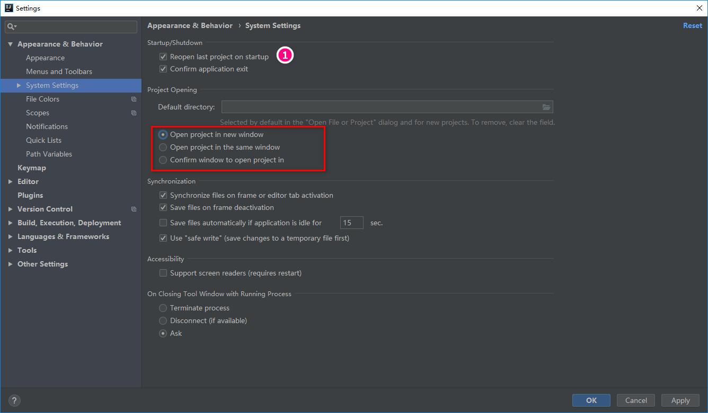

- 如标注1所示，启动 IntelliJ IDEA 的时候，默认会打开上次使用的项目，建议关闭，这样启动 IntelliJ IDEA 的时候可以选择最近打开的某个项目。
- 如上图红圈所示，该选项是设置当我们已经打开一个项目窗口的时候，再打开一个项目窗口的时候是选择怎样的打开方式。

    - `Open project in new window` 每次都使用新窗口打开。
    - `Open project in the same window` 每次都替换当前已打开的项目，这样桌面上就只有一个项目窗口。
    - `Confirm window to open project in` 每次都弹出提示窗口，让我们选择用新窗口打开或是替换当前项目窗口。

## 动态调整字体大小

    File > Settings > Editor > General

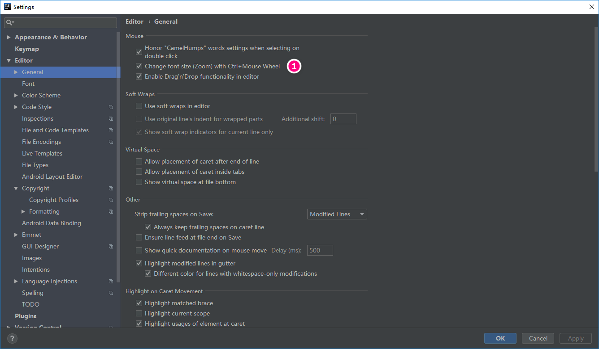

如标注1所示，开启后，即可通过 Ctrl + 鼠标滚轮动态调整字体大小。

## 显示工具栏、工具按钮

IntelliJ IDEA 默认是隐藏 `Toolbar` 和 `Tool Buttons` 的，如下图所示：

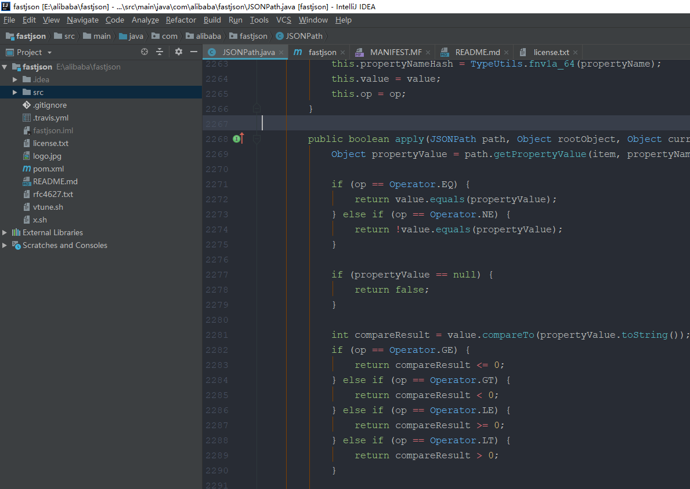

可以通过如下菜单路径，进行开启：

    View -> Toolbar  
    View -> Tool Buttons

调整后的效果如下：

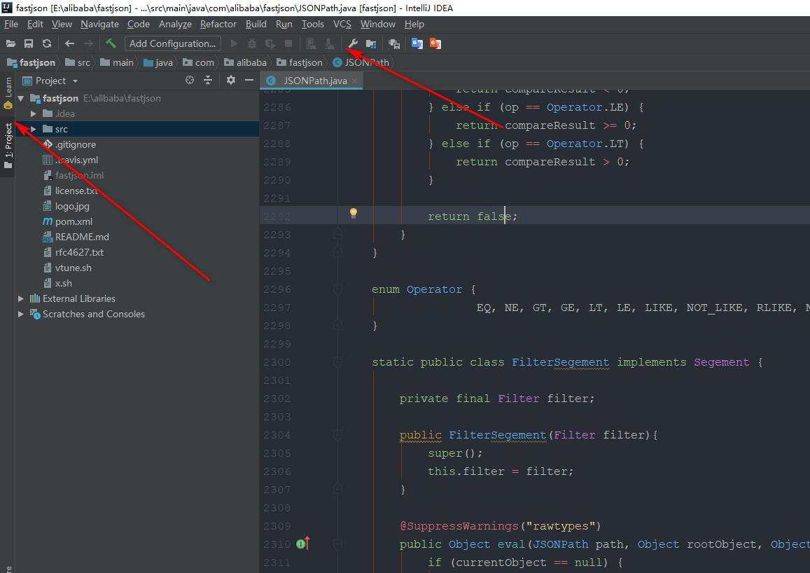

## 文件代码模板

    File > Settings > Editor > File and Code Templates

文件代码模板可以简单理解为：我们在项目中创建某些类型文件时，就已经在对应这些新文件中预设了代码内容。

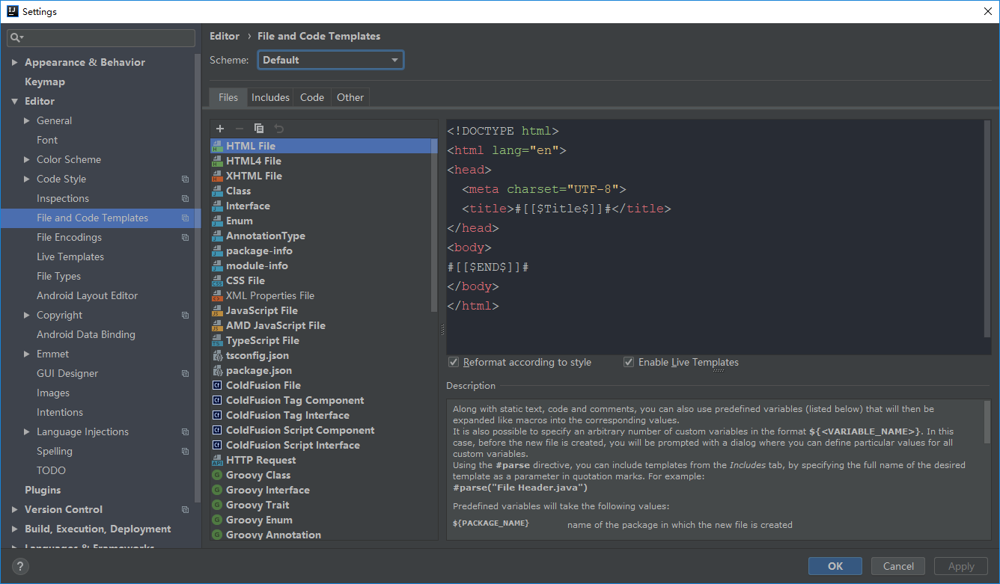

如上图所示，IntelliJ IDEA 默认新建类自带的类注释格式一般不够友好或是规范，所以我们一般需要自己根据公司编码规范进行设置。建议文件格式如下：

### HTML5 / HTML4 / XHTML

``` html
<!DOCTYPE html>
<html lang="zh-cmn-Hans">
<head>
    <meta charset="utf-8" />
    <meta name="renderer" content="webkit" />
    <meta http-equiv="X-UA-Compatible" content="IE=edge" />
    <meta name="viewport" content="width=device-width, initial-scale=1" />

    <title>#[[$Title$]]#</title>
</head>

<body>
    #[[$END$]]#
</body>
</html>
```

``` html
<!DOCTYPE HTML PUBLIC "-//W3C//DTD HTML 4.01 Transitional//EN" "http://www.w3.org/TR/html4/loose.dtd">
<html lang="zh-cmn-Hans">
<head>
    <meta charset="utf-8" />
    <meta name="renderer" content="webkit" />
    <meta http-equiv="X-UA-Compatible" content="IE=edge" />
    <meta name="viewport" content="width=device-width, initial-scale=1" />

    <title>#[[$Title$]]#</title>
</head>

<body>
    #[[$END$]]#
</body>
</html>
```

``` html
<?xml version="1.0" encoding="UTF-8"?>
<!DOCTYPE html PUBLIC "-//W3C//DTD XHTML 1.0 Transitional//EN" "http://www.w3.org/TR/xhtml1/DTD/xhtml1-transitional.dtd">
<html xmlns="http://www.w3.org/1999/xhtml" xml:lang="en" lang="zh-cn">
<head>
    <meta charset="utf-8" />
    <meta name="renderer" content="webkit" />
    <meta http-equiv="X-UA-Compatible" content="IE=edge" />
    <meta name="viewport" content="width=device-width, initial-scale=1" />

    <title>#[[$Title$]]#</title>
</head>

<body>
    #[[$END$]]#
</body>
</html>
```

### Class / Interface / Enum

``` java
#parse("File Header.java")
#if (${PACKAGE_NAME} && ${PACKAGE_NAME} != "")package ${PACKAGE_NAME};#end

public class ${NAME}
{

}
```

``` java
#parse("File Header.java")
#if (${PACKAGE_NAME} && ${PACKAGE_NAME} != "")package ${PACKAGE_NAME};#end

public interface ${NAME}
{

}
```

``` java
#parse("File Header.java")
#if (${PACKAGE_NAME} && ${PACKAGE_NAME} != "")package ${PACKAGE_NAME};#end

public enum ${NAME}
{
}
```

``` java
#parse("File Header.java")
#if (${PACKAGE_NAME} && ${PACKAGE_NAME} != "")package ${PACKAGE_NAME};#end

public @interface ${NAME}
{

}
```

## 文件头注释

在一些公司的编码规范里面，每个文件头都会包含固定格式的头注释，尤其在开源项目最常见，IntelliJ IDEA 可以很方便的进行配置，并且有很多模板变量供我们使用。

    File > Settings > Editor > File and Code Templates

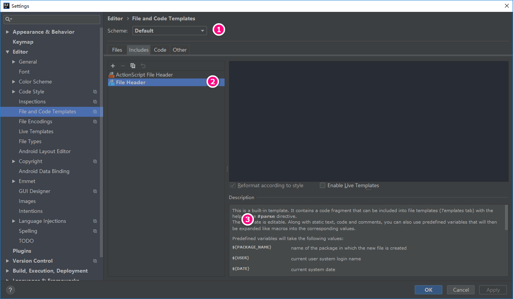

- 标注1所示，可以切换全局配置或针对项目的配置。
- 标注2所示，该 File Header 文件就是前面 Java 文件代码模板中引入语句中 #parse("File Header.java") 文件。
- 标注3所示，介绍当前文件模板的一些信息，以及一些预设变量的作用介绍。

## 插件安装

    File > Settings > Plugins

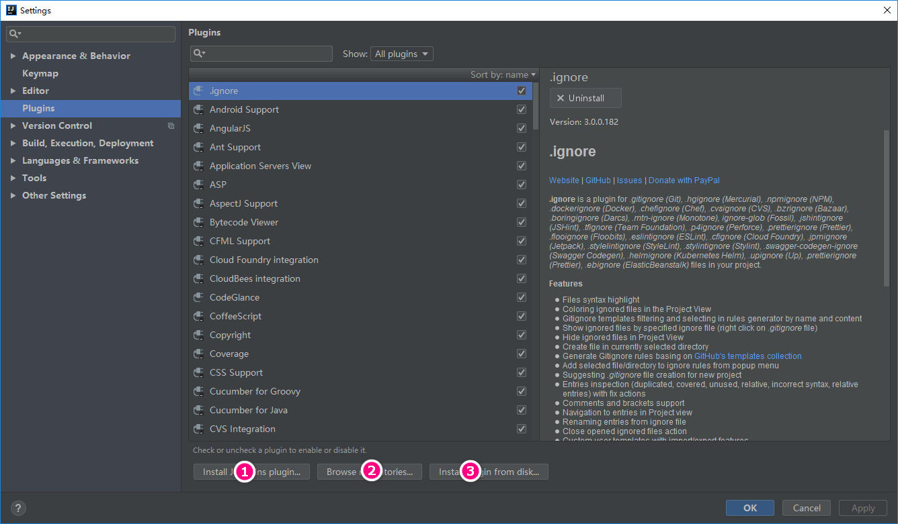

- 标注1所示，弹出 IntelliJ IDEA 公司自行开发的插件仓库列表，供下载安装。
- 标注2所示，弹出插件仓库中所有插件列表供下载安装。
- 标注3所示，浏览本地的插件文件进行安装，而不是从服务器上下载并安装。

## 常用插件推荐

|插件名称    |插件介绍      |官网地址        |
|:-----------------|:----------|:--------------|
|JavaDoc|快捷生成文档注释插件|<http://setial.github.io/intellij-javadocs>|
|Gitee|开源中国的码云插件|<https://plugins.jetbrains.com/plugin/8383-gitee>|
|Alibaba Java Coding Guidelines|阿里巴巴出的代码规范检查插件|https://plugins.jetbrains.com/plugin/10046-alibaba-java-coding-guidelines|
|IDE Features Trainer|IntelliJ IDEA 官方出的学习辅助插件|<https://plugins.jetbrains.com/plugin/8554?pr=idea>|
|Key promoter|快捷键提示|<https://plugins.jetbrains.com/plugin/4455?pr=idea>|
|Grep Console|自定义设置控制台输出颜色|<https://plugins.jetbrains.com/idea/plugin/7125-grep-console>|
|String Manipulation|驼峰式命名和下划线命名交替变化|<https://plugins.jetbrains.com/plugin/2162?pr=idea>|
|CheckStyle-IDEA|代码规范检查|<https://plugins.jetbrains.com/plugin/1065?pr=idea>|
|FindBugs-IDEA|潜在 Bug 检查|<https://plugins.jetbrains.com/plugin/3847?pr=idea>|
|MetricsReloaded|代码复杂度检查|<https://plugins.jetbrains.com/plugin/93?pr=idea>|
|Statistic|代码统计|<https://plugins.jetbrains.com/plugin/4509?pr=idea>|
|JRebel Plugin|热部署|<https://plugins.jetbrains.com/plugin/?id=4441>|
|CodeGlance|在编辑代码最右侧，显示一块代码小地图|<https://plugins.jetbrains.com/plugin/7275?pr=idea>|
|GsonFormat|把 JSON 字符串直接实例化成类|<https://plugins.jetbrains.com/plugin/7654?pr=idea>|
|Markdown Navigator|书写 Markdown 文章|<https://plugins.jetbrains.com/plugin/7896?pr=idea>|
|Eclipse Code Formatter|使用 Eclipse 的代码格式化风格，在一个团队中如果公司有规定格式化风格，这个可以使用。|<https://plugins.jetbrains.com/plugin/6546?pr=idea>|
|Jindent-Source Code Formatter|自定义类、方法、doc、变量注释模板|<http://plugins.jetbrains.com/plugin/2170?pr=idea>|
|Translation|翻译插件|<https://github.com/YiiGuxing/TranslationPlugin>|
|Maven Helper|Maven 辅助插件|<https://plugins.jetbrains.com/plugin/7179-maven-helper>|
|Properties to YAML Converter|把 Properties 的配置格式改为 YAML 格式|<https://plugins.jetbrains.com/plugin/8000-properties-to-yaml-converter>|
|Git Flow Integration|Git Flow 的图形界面操作|<https://plugins.jetbrains.com/plugin/7315-git-flow-integration>|
|Rainbow Brackets|对各个对称括号进行着色，方便查看|<https://github.com/izhangzhihao/intellij-rainbow-brackets>|
|MybatisX|mybatis 框架辅助（免费）|<https://plugins.jetbrains.com/plugin/10119-mybatisx>|
|Lombok Plugin|Lombok 功能辅助插件|<https://plugins.jetbrains.com/plugin/6317-lombok-plugin>|
|.ignore|各类版本控制忽略文件生成工具|<https://plugins.jetbrains.com/plugin/7495--ignore>|
|mongo4idea|mongo客户端|<https://github.com/dboissier/mongo4idea>|
|iedis|redis客户端|<https://plugins.jetbrains.com/plugin/9228-iedis>|
|GenerateAllSetter|new POJO类的快速生成 set 方法|<https://plugins.jetbrains.com/plugin/9360-generateallsetter>|

## 参考资料

- [IntelliJ-IDEA-Tutorial](https://github.com/judasn/IntelliJ-IDEA-Tutorial)